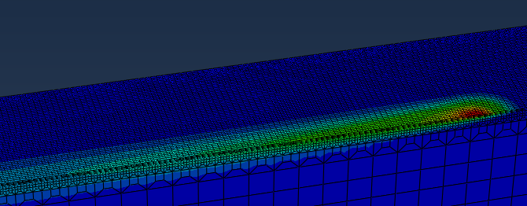
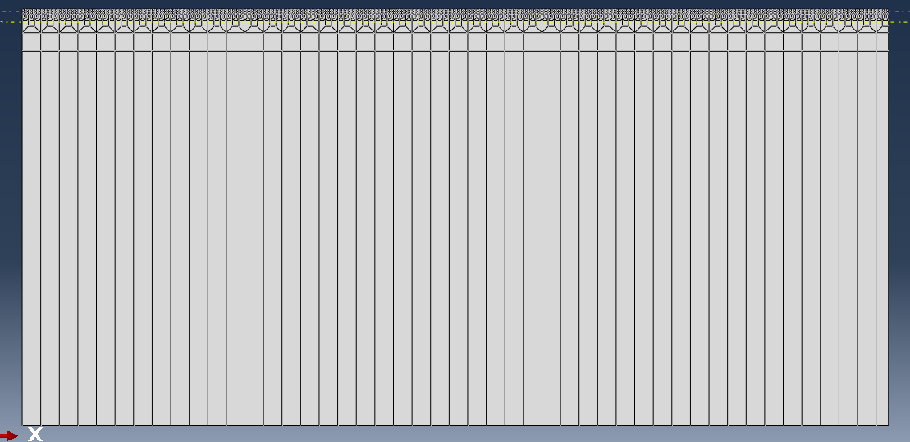
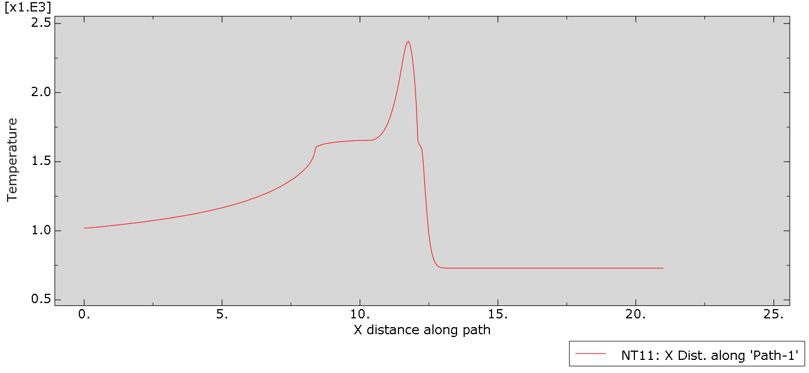

# Thermal model of powder-bed electron-beam melting in Abaqus

A transient heat-transfer model of one electron-beam scan over a Ti-6Al-4V powder bed, built in Abaqus/Standard. The moving beam is a user subroutine (DFLUX) that deposits a Gaussian heat source in the powder layer of a preheated block. The model setup follows N. An et al., "Implementation of Abaqus user subroutines and plugin for thermal analysis of powder-bed electron-beam-melting additive manufacturing process," *Materials Today Communications* 27 (2021) 102307, [doi:10.1016/j.mtcomm.2021.102307](https://doi.org/10.1016/j.mtcomm.2021.102307).

Course project, Shiraz University, 2022.



*Temperature field around the scan track at the end of the step (t = 0.02 s). The colour scale runs from 730 °C (blue) to 2380 °C (red).*

## Model

| | |
|---|---|
| Geometry | 21 × 2.5 × 10.07 mm block, half model about the scan line (y = 0). The top 0.07 mm is partitioned as the powder layer, and further partitions refine the mesh near the surface. |
| Mesh | 198,600 linear heat-transfer bricks (DC3D8). In the powder layer, 0.05 × 0.05 mm in plane with 4 elements through the thickness; coarser with depth. |
| Material | Ti-6Al-4V with the temperature-dependent conductivity, density and specific heat of the solid from An et al. (2021); latent heat 440 kJ/kg between 1605 °C (solidus) and 1655 °C (liquidus). Tables in `data/material_properties.csv`. |
| Initial and boundary conditions | Whole block at 730 °C; bottom face held at 730 °C; radiation from the top surface to 730 °C, emissivity 0.7. |
| Beam | 60 kV, 6.7 mA (402 W), absorption efficiency 0.9, Gaussian beam with Φ = 0.55 mm, moving at 632.6 mm/s along x and starting 0.55 mm before the block. |
| Step | 0.02 s transient with automatic increments, at most 100 °C change per increment. |



### Heat source

With the beam centre at $x_0 = -\Phi + v t$, the surface intensity and the depth profile are

$$H_s = \frac{2 U I_b}{\pi \Phi^2} \exp\left(-\frac{2\left[(x - x_0)^2 + y^2\right]}{\Phi^2}\right), \qquad I_z = \frac{1}{0.75}\left[-2.25\left(\frac{d}{S}\right)^2 + 1.5\,\frac{d}{S} + 0.75\right]$$

where $d$ is the depth below the top surface and $S$ = 0.062 mm is the penetration depth. The body flux is $\eta H_s I_z / S$ for $0 \le d \le S$ and zero below. Integrated over the powder layer of this mesh, it gives 180.80 W, which is 99.95% of the nominal $\eta U I_b / 2$ = 180.90 W for the half model (`tools/check_heat_input.py`).

## Results



*Temperature (°C) along the scan path at the end of the step (t = 0.02 s), with the beam at x ≈ 12 mm. Ahead of the beam the powder stays at the 730 °C preheat. Just behind the peak, a plateau near the 1605 to 1655 °C melting range marks the solidifying melt pool.*

## Run it

From the `model/` folder, with Abaqus/Standard and a Fortran compiler set up for user subroutines:

```bash
abaqus job=ebm_single_track user=dflux.for cpus=8 interactive
```

The model was built in Abaqus/CAE 2020. Units are mm, s, tonne and mJ, so power is in mW and temperature in °C.

## Files

| Path | Contents |
|---|---|
| `model/ebm_single_track.inp` | Main input deck: material, step, loads and boundary conditions |
| `model/ebm_mesh.inp` | Nodes and elements (included by the main deck) |
| `model/ebm_sets.inp` | Node sets, element sets and top-surface faces (included by the main deck) |
| `model/dflux.for` | User subroutine for the moving beam |
| `data/material_properties.csv` | Material tables in SI units |
| `tools/check_heat_input.py` | Integrates the beam flux over the mesh and compares it with the nominal power (needs NumPy) |
| `figures/` | Results and mesh images from Abaqus/CAE |

## License

MIT, see `LICENSE`.
